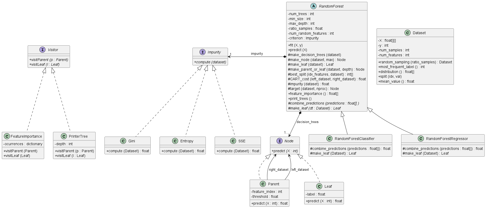

# 🌲 Custom Random Forest from Scratch

This project presents a fully custom-built **Random Forest** algorithm implemented in Python. It supports:
- Classification
- Regression
- Isolation Forest for anomaly detection
- Feature importance using the Visitor design pattern
- Optional optimizations: Extra Trees & Multiprocessing

---

## 🧠 Key Features

- Written 100% from scratch using only `numpy`, `matplotlib`, and `pandas`
- Modular architecture (Dataset handling, Impurity measures, Node structure, etc.)
- Implements classical impurity metrics (Gini, Entropy, SSE)
- Supports real-world datasets like MNIST, Sonar, and credit card fraud detection
- UML diagram for architecture understanding

---

## 📂 Project Structure

```
├── main.py                  # Entry point: user selects regressor or classifier with CLI
├── Dataset.py               # Dataset class: sampling, splitting, stats
├── ImpurityMeasure.py       # Gini, Entropy, SSE classes
├── RandomForest.py          # Core Random Forest logic and models
├── Node.py                  # Parent/Leaf node hierarchy
├── Visitor.py               # Feature importance & tree printer via Visitor pattern
├── logger.py                # Custom logging utility
├── isolaitontest.py         # Synthetic anomaly detection demo
├── isotestMNIST.py          # Isolation Forest on MNIST dataset
├── testCREDIT.py            # Isolation Forest on credit card fraud data
├── creditcard_10K.csv       # Sample dataset for fraud detection
├── mnist.pkl / rf_mnist.pkl # MNIST data and pre-trained model
├── sonar.all-data           # Sonar classification dataset
├── design.puml / design.png # UML class diagram (see below)
```

---

## 📊 UML Class Diagram

A UML diagram showing the class relationships is available in the repository:



---

## 🚀 Getting Started

### Requirements
```bash
pip install numpy matplotlib pandas scikit-learn
```

### Run Random Forest
```bash
python main.py
```
You will be prompted to:
1. Choose between classifier or regressor
2. Select optimization mode: None, Extra Trees, or Multiprocessing
3. Pick dataset: Iris, Sonar, Temperatures, or MNIST

---

## 📈 Use Cases

- **Classification**: `RandomForestClassifier`
- **Regression**: `RandomForestRegressor`
- **Anomaly Detection**: `IsolationForest` (based on tree depths)

Example:
```bash
python testCREDIT.py
```
Detects anomalies in the credit card transactions dataset.

---

## 👨‍💻 Author

David Ruiz Cáceres

Developed as part of a machine learning coursework project, with focus on object-oriented design, optimization, and deep understanding of decision trees.

---

## 📜 License

MIT License (add if applicable)

